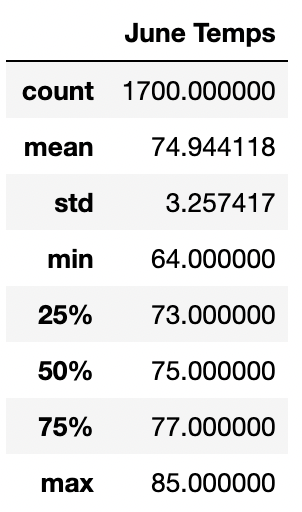
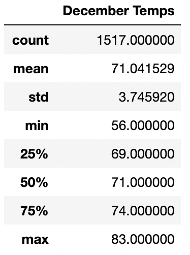

# Surfs Up Analysis

## Overview: 
The purpose of this analysis is to provide more information about the temperature trends on Oahu before opening the surf shop. Temperature data was analyzed for the months of June and December to find if opening an ice cream and surf shop was a sustainable year-round business. 

### Resources: 
[hawaii.sqlite](hawaii.sqlite)

### Software: 
Jupyter 6.1.4, SQLite

## Results: 
-	The average temp for the months of June and December is between 70 and 75
-	The max temp for the months of June and December is between 83 and 85
-	The min temp for the months of June and December is between 56 and 64

 

## Summary: 
The results of the analysis for June and December provide the information necessary to support opening an ice cream and surf shop on Oahu. Given that the average temp ranges between 70 and 75 it would be sustainable to run the shop as a year-round business. But it should be expected that the volume in these months will fluctuate year-to-year given the variation between the max temp and min temp.  

An additional query to perform would be to find the days in the months of June and December that had the least and greatest precipitation. Another query to perform would be to find which days in June and December are the hottest and coldest.  
